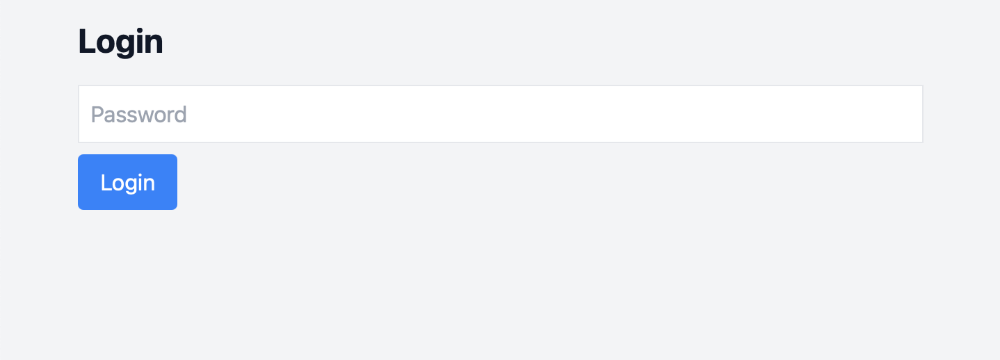
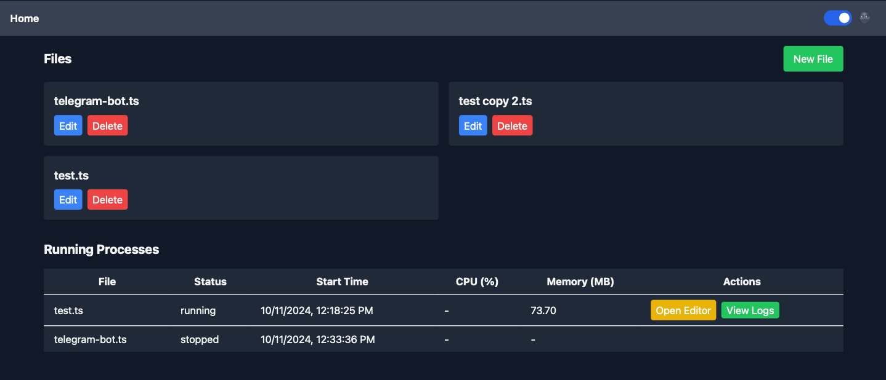
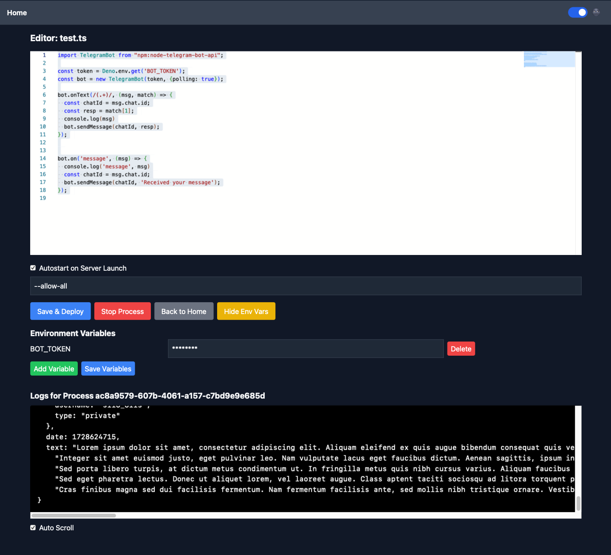
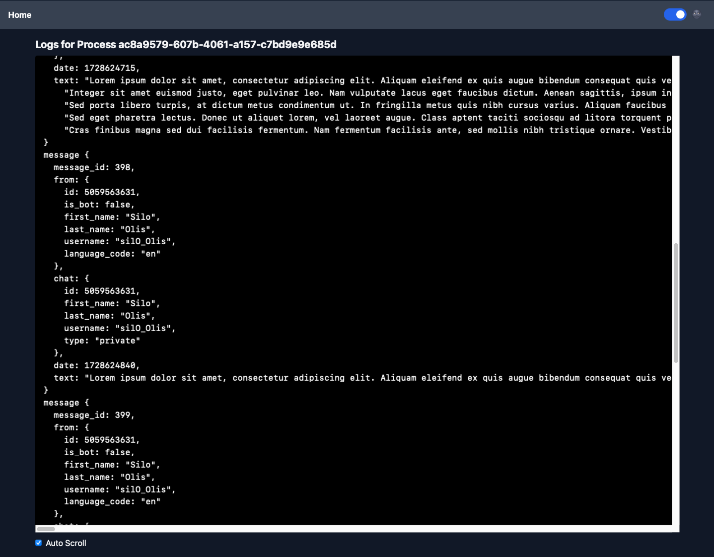

# 🦕 Deno Deployer

A web-based platform to edit, deploy, and manage Deno scripts, inspired by [Deno Deploy](https://deno.com/deploy). This project provides a user-friendly interface to write TypeScript code, manage processes, view logs, handle environment variables, and monitor resource usage.

## 📸 Screenshots

| Login | Home Page | Code Editor | Logs Viewer |
|-------|-----------|-------------|-------------|
|  |  |  |  |

## ✨ Features

- 🔐 **User Authentication**: Secure login system using JWT and bcrypt for password hashing.
- 💻 **Code Editor**: Integrated Monaco Editor with TypeScript and Deno typings support.
- 🚀 **Process Management**:
  - Deploy and run Deno scripts directly from the web interface.
  - Start, stop, and monitor running processes.
  - View real-time CPU and memory usage for each process.
- 🔧 **Environment Variables**:
  - Add, update, and delete environment variables securely.
  - Environment variables are encrypted and stored safely.
- 📊 **Logs**:
  - Real-time logs viewing for running processes.
  - Auto-scroll feature for logs.
- 🌓 **Dark Mode**: Toggle between light and dark themes.
- 📱 **Responsive UI**: Built with Tailwind CSS for a responsive and modern design.

## 📁 Project Structure

- `src/`: Contains React components and styles.
- `server/`: Contains the Express server and API endpoints.
- `codes/`: Directory where user scripts are stored.
- `configs/`: Stores configurations and encrypted environment variables.
- `logs/`: Stores logs for each running process.
- `deno_types/`: Contains Deno typings for the Monaco Editor.

## 🛠️ Installation and Setup

### Prerequisites

- **Node.js** (v18 or higher)
- **npm** (v9 or higher)
- **Deno** (ensure Deno is installed and accessible in your PATH)

### Clone the Repository

```bash
git clone https://github.com/igroza/deno-deployer.git
cd deno-deployer
```

### Install Dependencies

```bash
npm install
```

### Set Up Environment Variables

- **Create a `.env` File:**
  
  Copy the `.env.example` to create your own `.env` file:
  
  ```bash
  cp .env.example .env
  ```

- **Configure Environment Variables:**
  
  Open the newly created `.env` file and set your `SECRET_KEY` and `PASSWORD`:
  
  ```env
  SECRET_KEY=your-very-secure-secret-key
  PASSWORD=your-secure-password
  DENO_PATH=deno
  ```

- **Ensure Security:**
  
  Make sure that your `.env` file is **not** committed to version control. This is already handled by the existing `.gitignore` configuration.

## 🚀 Usage

### Running the Project

```bash
npm run start
```

### Running with Docker

1. **Build the Docker Image**

   ```bash
   npm run docker:build
   ```

2. **Run the Docker Container**

   ```bash
   npm run docker:run
   ```

   The server will run at `http://localhost:8000`.

## 📝 Usage Guide

### Login

- Open `http://localhost:8000` in your browser.
- Use the password you set in `server/index.js` to log in.

### Create a New File

- Click on the **New File** button.
- Enter a filename (e.g., `app.ts`).

### Edit Code

- Write your Deno TypeScript code in the Monaco Editor.
- The editor supports Deno typings for a better development experience.

### Manage Environment Variables

- Click on **Manage Env Vars**.
- Add new variables or delete existing ones.
- Click **Save** to apply changes.
- All variables are encrypted and stored securely.

### Deploy and Run

- Set the necessary Deno flags (e.g., `--allow-net`, `--allow-read`).
- Click on **Save & Deploy** to run the script.
- The process will start, and logs will be displayed in real-time.

### Process Management

- View running processes on the Home page.
- Monitor CPU and memory usage.
- Stop processes as needed.

### View Logs

- Access detailed logs for each process.
- Auto-scroll through logs for real-time monitoring.

## 🤝 Contributing

Contributions are welcome! Please open an issue or submit a pull request on GitHub.

## 🗺️ Roadmap

- 🧪 **Testing**: Add unit tests for the server and client.
- 🔧 **Deno.serve**: Enable port forwarding for web servers.
- ⏰ **Deno.cron**: Add scheduling capabilities to run scripts at specified intervals using `Deno.cron`.
- 🗄️ **Deno.openKV**: Incorporate key-value storage with `Deno.openKV` for persistent data management.
- 🎨 **UI Improvements**: Enhance the user interface for better usability and aesthetics.
- 🚀 **Server Enhancements**: Optimize server performance and add new features to improve reliability and scalability.
- 📄 **TypeScript Support**: Add TypeScript support for better development experience.

## 📄 License

This project is licensed under the MIT License.